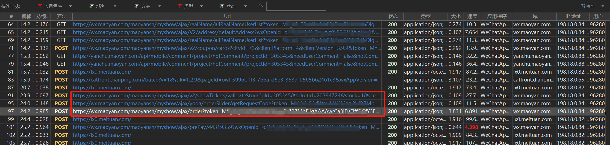
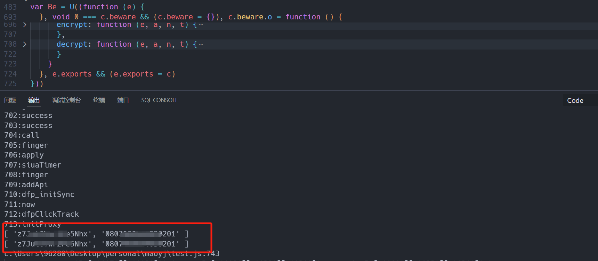
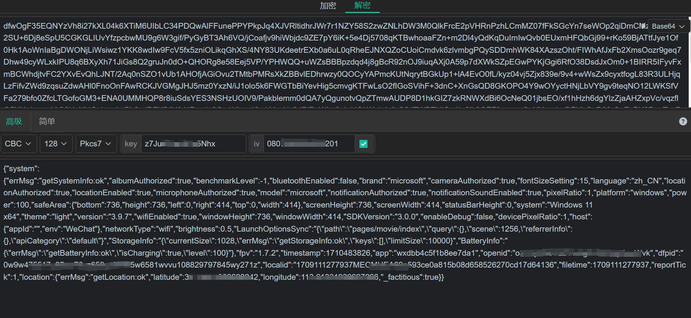
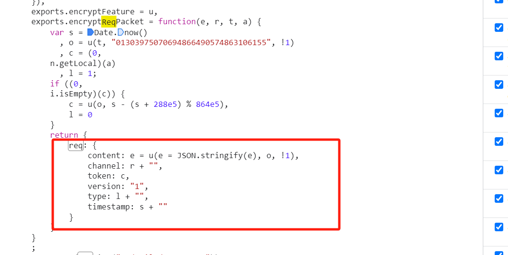

## 说明
用于记录自己学习和研究爬虫和js逆向，因此不提供任何代码以及相关参数
## 抓包
这里用的是windows电脑端的微信小程序，使用httpdebuger抓取买票时发送的数据包
可以看到当点击购票按钮时，会发送三个http请求，order则是真正的购买请求

## order参数分析
分析数据包，除去一些用户不变的token和演出id，票档id之外，总结一下有四个动态变化而且内容加密的关键参数，
请求头中的mtgsig
url参数中的_toekn
postdata中的fingerprint和txdevicetoken

下面按照我分析时的顺序来，

### fingerprint
（ps：分析fingerprint的时候还没了解过js逆向）
base64编码的，分析有可能是aes，des等对称加密方式
使用unviel对小程序逆向出源码，放到开发者工具中查看，发现不管是unviel还是wxupper，都无法逆向出其中引用的插件
跑不起来就阅读源码吧，一番查找下，发现risk-fingerprint.js文件，其中一段很长的数组耐人寻味，
继续阅读下去，发现一些关键内容都是对这个数组进行解密得到的，单独运行相关代码
成功得到key和iv，解密成功

### txdevicetoken
ps：这时候开始看了几篇js逆向的博客，搜索github得到了在微信里调试小程序的神器
txdevicetoken的生成引用了一个turingSDK的插件，是post发送请求给jprx/1449，服务器返回的，但是请求的data内容又是加密的，
单步调试，发现构造请求代码段

把这些代码复制下来，分析函数的参数，最终可以自己构造请求

不过这个请求的header有个hostsign的参数，是十分钟一变化的，小程序开发文档一搜就知道这个参数怎么回事

### _toekn
跟上一步一样，慢慢调试分析就可以了

### mtgsig
看不懂，。。。。。
